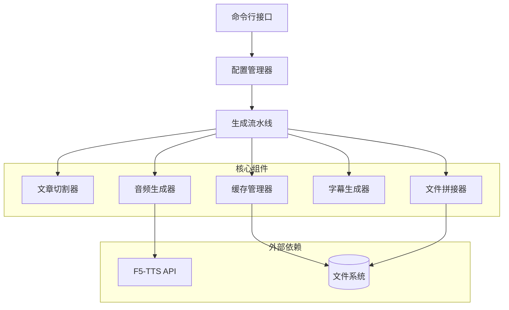
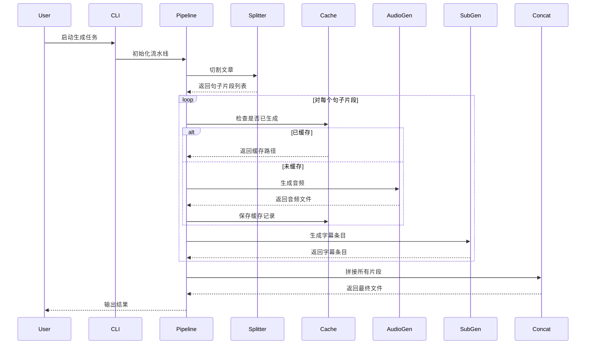

# 设计文档

## 概述

本系统是一个基于F5-TTS的文本转语音文章生成器，采用模块化设计，将长篇文章转换为高质量的语音和字幕文件。系统的核心流程包括：文章切割、音频生成、字幕生成、文件拼接和缓存管理。

系统设计遵循单一职责原则，每个组件负责特定的功能，通过清晰的接口进行交互。支持断点续传机制，可以在中断后继续生成，避免重复工作。

## 架构

### 系统架构图



### 数据流



## 组件和接口

### 1. 配置管理器 (ConfigManager)

负责加载和管理系统配置。

**接口**:

```python
class Config:
    """配置数据类"""
    input_article: str          # 输入文章路径
    output_dir: str             # 输出目录
    cache_dir: str              # 缓存目录
    max_sentence_length: int    # 最大句子长度（字符数）
    model_name: str             # F5-TTS模型名称
    nfe_step: int              # 采样步数
    cfg_strength: float        # CFG强度
    speed: float               # 语速
    voices: Dict[str, VoiceConfig]  # 音色配置
    enable_cache: bool         # 是否启用缓存

class VoiceConfig:
    """音色配置"""
    name: str                  # 音色名称
    ref_audio: str            # 参考音频路径
    ref_text: str             # 参考文本（可选）
    speed: float              # 语速（可选，覆盖全局设置）

class ConfigManager:
    @staticmethod
    def load_config(config_path: str) -> Config:
        """从TOML文件加载配置"""
        pass

    @staticmethod
    def get_default_config() -> Config:
        """获取默认配置"""
        pass

    @staticmethod
    def validate_config(config: Config) -> List[str]:
        """验证配置，返回错误列表"""
        pass
```

**实现细节**:

- 使用TOML格式作为配置文件格式
- 支持配置验证，检查文件路径是否存在
- 提供默认配置值
- 命令行参数可以覆盖配置文件中的值

### 2. 文章切割器 (ArticleSplitter)

负责将文章切割成适合语音合成的句子片段。

**接口**:

```python
class SentenceSegment:
    """句子片段数据类"""
    index: int                 # 片段序号
    text: str                  # 片段文本
    voice_name: str           # 使用的音色名称

class ArticleSplitter:
    def __init__(self, max_length: int = 200):
        """
        初始化文章切割器

        Args:
            max_length: 最大句子长度（字符数）
        """
        pass

    def split(self, article: str, default_voice: str = "main") -> List[SentenceSegment]:
        """
        切割文章为句子片段

        Args:
            article: 输入文章文本
            default_voice: 默认音色名称

        Returns:
            句子片段列表
        """
        pass

    def _parse_voice_markers(self, text: str) -> List[Tuple[str, str]]:
        """解析文本中的音色标记，如[voice_name]"""
        pass

    def _split_by_punctuation(self, text: str) -> List[str]:
        """按标点符号切割文本"""
        pass
```

**实现细节**:

- 使用正则表达式识别句子边界（句号、问号、感叹号等）
- 支持中英文标点符号
- 识别音色标记格式：`[voice_name]`，标记后的文本使用指定音色
- 如果句子超过最大长度，在逗号、分号等次要标点处进一步切割
- 保留原文的换行和空格信息
- 为每个片段分配连续的序号

### 3. 缓存管理器 (CacheManager)

负责管理已生成文件的缓存，实现断点续传功能。

**接口**:

```python
class CacheEntry:
    """缓存条目"""
    segment_index: int         # 片段序号
    audio_path: str           # 音频文件路径
    duration: float           # 音频时长（秒）
    text: str                 # 文本内容
    voice_name: str          # 音色名称
    timestamp: float         # 生成时间戳

class CacheManager:
    def __init__(self, cache_dir: str, task_id: str):
        """
        初始化缓存管理器

        Args:
            cache_dir: 缓存目录
            task_id: 任务唯一标识
        """
        pass

    def load_cache(self) -> Dict[int, CacheEntry]:
        """加载缓存记录"""
        pass

    def save_cache(self, cache: Dict[int, CacheEntry]):
        """保存缓存记录"""
        pass

    def get_entry(self, segment_index: int) -> Optional[CacheEntry]:
        """获取指定片段的缓存条目"""
        pass

    def add_entry(self, entry: CacheEntry):
        """添加缓存条目"""
        pass

    def validate_entry(self, entry: CacheEntry) -> bool:
        """验证缓存条目是否有效（文件存在且大小合理）"""
        pass

    def clear_cache(self):
        """清除所有缓存"""
        pass

    def generate_task_id(self, article_path: str, config: Config) -> str:
        """根据文章路径和配置生成任务ID"""
        pass
```

**实现细节**:

- 使用JSON格式存储缓存元数据
- 缓存文件命名：`cache_{task_id}.json`
- 任务ID基于文章内容和配置的哈希值生成，确保相同输入产生相同ID
- 验证缓存时检查：文件是否存在、文件大小是否大于0
- 音频文件命名：`segment_{index:04d}.wav`

### 4. 音频生成器 (AudioGenerator)

负责调用F5-TTS生成音频文件。

**接口**:

```python
class AudioGenerator:
    def __init__(self, config: Config):
        """
        初始化音频生成器

        Args:
            config: 系统配置
        """
        pass

    def initialize_model(self):
        """初始化F5-TTS模型"""
        pass

    def generate(
        self,
        segment: SentenceSegment,
        voice_config: VoiceConfig,
        output_path: str
    ) -> Tuple[str, float]:
        """
        为句子片段生成音频

        Args:
            segment: 句子片段
            voice_config: 音色配置
            output_path: 输出文件路径

        Returns:
            (音频文件路径, 音频时长)
        """
        pass

    def get_audio_duration(self, audio_path: str) -> float:
        """获取音频文件时长"""
        pass
```

**实现细节**:

- 使用F5-TTS的API接口（`f5_tts.api.F5TTS`）
- 懒加载模型，首次调用时才初始化
- 支持配置模型参数：nfe_step、cfg_strength、speed等
- 使用torchaudio或soundfile读取音频时长
- 错误处理：捕获生成失败的异常，记录日志但不中断整体流程

### 5. 字幕生成器 (SubtitleGenerator)

负责生成SRT格式的字幕文件。

**接口**:

```python
class SubtitleEntry:
    """字幕条目"""
    index: int                 # 字幕序号
    start_time: float         # 开始时间（秒）
    end_time: float           # 结束时间（秒）
    text: str                 # 字幕文本

class SubtitleGenerator:
    def __init__(self):
        pass

    def create_entry(
        self,
        index: int,
        start_time: float,
        duration: float,
        text: str
    ) -> SubtitleEntry:
        """创建字幕条目"""
        pass

    def format_time(self, seconds: float) -> str:
        """将秒数格式化为SRT时间格式 (HH:MM:SS,mmm)"""
        pass

    def generate_srt(self, entries: List[SubtitleEntry], output_path: str):
        """生成SRT字幕文件"""
        pass
```

**实现细节**:

- SRT时间格式：`HH:MM:SS,mmm`（小时:分钟:秒,毫秒）
- 字幕条目格式：

  ```
  1
  00:00:00,000 --> 00:00:05,500
  这是第一句话

  2
  00:00:05,500 --> 00:00:10,200
  这是第二句话
  ```

- 累计计算每个条目的开始和结束时间
- 移除音色标记（如`[voice_name]`）后再写入字幕

### 6. 文件拼接器 (FileConcatenator)

负责拼接多个音频文件和字幕文件。

**接口**:

```python
class FileConcatenator:
    def __init__(self):
        pass

    def concatenate_audio(
        self,
        audio_paths: List[str],
        output_path: str,
        cross_fade_duration: float = 0.15
    ) -> str:
        """
        拼接音频文件

        Args:
            audio_paths: 音频文件路径列表
            output_path: 输出文件路径
            cross_fade_duration: 交叉淡入淡出时长（秒）

        Returns:
            输出文件路径
        """
        pass

    def concatenate_subtitles(
        self,
        entries: List[SubtitleEntry],
        output_path: str
    ) -> str:
        """
        合并字幕条目并生成字幕文件

        Args:
            entries: 字幕条目列表
            output_path: 输出文件路径

        Returns:
            输出文件路径
        """
        pass
```

**实现细节**:

- 音频拼接使用pydub库的AudioSegment
- 支持交叉淡入淡出（cross-fade）以平滑过渡
- 保持音频采样率和格式一致（24kHz, WAV）
- 字幕拼接直接合并SubtitleEntry列表，时间戳已在生成时计算好

### 7. 生成流水线 (GenerationPipeline)

协调各个组件完成整个生成流程。

**接口**:

```python
class GenerationPipeline:
    def __init__(self, config: Config):
        """
        初始化生成流水线

        Args:
            config: 系统配置
        """
        pass

    def run(self) -> Tuple[str, str]:
        """
        执行生成流程

        Returns:
            (最终音频文件路径, 最终字幕文件路径)
        """
        pass

    def _load_article(self) -> str:
        """加载文章文本"""
        pass

    def _process_segments(
        self,
        segments: List[SentenceSegment]
    ) -> List[Tuple[str, float, SubtitleEntry]]:
        """处理所有句子片段，返回(音频路径, 时长, 字幕条目)列表"""
        pass
```

**实现细节**:

- 流程步骤：
  1. 加载配置和文章
  2. 切割文章为句子片段
  3. 初始化缓存管理器
  4. 对每个片段：
     - 检查缓存
     - 如果未缓存，生成音频
     - 生成字幕条目
     - 更新缓存
  5. 拼接所有音频和字幕
  6. 保存最终文件
- 使用tqdm显示进度条
- 记录成功/失败/跳过的片段统计

### 8. 命令行接口 (CLI)

提供用户交互的命令行接口。

**接口**:

```python
def main():
    """主入口函数"""
    pass

def parse_arguments() -> argparse.Namespace:
    """解析命令行参数"""
    pass

def setup_logging(log_file: str):
    """配置日志系统"""
    pass
```

**命令行参数**:

```bash
python -m tts_article_generator \
    --config config.toml \
    --input article.txt \
    --output output/ \
    --no-cache \
    --clear-cache \
    --verbose
```

**参数说明**:

- `--config`: 配置文件路径（默认：config.toml）
- `--input`: 输入文章文件路径（覆盖配置文件）
- `--output`: 输出目录（覆盖配置文件）
- `--no-cache`: 禁用缓存功能
- `--clear-cache`: 清除现有缓存并重新生成
- `--verbose`: 显示详细日志

## 数据模型

### 配置文件格式 (TOML)

```toml
# 基本配置
input_article = "article.txt"
output_dir = "output"
cache_dir = ".cache"
enable_cache = true

# 文章切割配置
max_sentence_length = 200

# F5-TTS模型配置
model_name = "F5TTS_v1_Base"
nfe_step = 32
cfg_strength = 2.0
speed = 1.0

# 默认音色（必须）
[voices.main]
ref_audio = "voices/main.wav"
ref_text = ""  # 留空则自动转录

# 额外音色（可选）
[voices.narrator]
ref_audio = "voices/narrator.wav"
ref_text = "这是旁白的声音"
speed = 0.9

[voices.character1]
ref_audio = "voices/character1.wav"
ref_text = ""
```

### 缓存文件格式 (JSON)

```json
{
  "task_id": "abc123def456",
  "article_hash": "md5_hash_of_article",
  "config_hash": "md5_hash_of_config",
  "created_at": 1234567890.123,
  "entries": {
    "0": {
      "segment_index": 0,
      "audio_path": "output/segments/segment_0000.wav",
      "duration": 5.5,
      "text": "这是第一句话。",
      "voice_name": "main",
      "timestamp": 1234567890.123
    },
    "1": {
      "segment_index": 1,
      "audio_path": "output/segments/segment_0001.wav",
      "duration": 4.2,
      "text": "这是第二句话。",
      "voice_name": "main",
      "timestamp": 1234567891.456
    }
  }
}
```

### 文章音色标记格式

```text
这是使用默认音色的文本。

[narrator]
这段文本将使用narrator音色。
可以跨越多行。

[character1]
这段文本将使用character1音色。

[main]
切换回默认音色。
```

## 正确性属性

_属性是一个特征或行为，应该在系统的所有有效执行中保持为真——本质上是关于系统应该做什么的正式陈述。属性作为人类可读规范和机器可验证正确性保证之间的桥梁。_

### 属性 1: 句子片段长度限制

*对于任意*文章文本，切割后的所有句子片段的长度都不应超过配置的最大长度（默认200字符）。

**验证: 需求 1.2**

### 属性 2: 切割点位于标点符号

*对于任意*文章文本，所有句子片段的切割点都应该位于标点符号处（句号、问号、感叹号、逗号、分号等）。

**验证: 需求 1.1, 1.3**

### 属性 3: 切割保留原文内容

*对于任意*文章文本，将所有切割后的句子片段按顺序拼接（包括标点和空格），应该能够还原原始文章内容。

**验证: 需求 1.4**

### 属性 4: 片段序号唯一且连续

*对于任意*文章文本，切割后的句子片段序号应该从0开始，连续递增，且每个序号唯一。

**验证: 需求 1.5**

### 属性 5: 音色文件格式验证

*对于任意*提供的音色文件，系统应该正确识别其是否为有效的WAV格式音频文件，拒绝无效文件。

**验证: 需求 2.2**

### 属性 6: 音色标识符唯一性

*对于任意*音色配置集合，每个音色文件应该被分配一个唯一的标识符，不存在重复。

**验证: 需求 2.3**

### 属性 7: 音色标记识别

*对于任意*包含音色标记的文章文本，系统应该正确识别所有音色标记（如[voice_name]），并将标记后的文本与对应的音色关联。

**验证: 需求 2.5**

### 属性 8: 音频文件生成完整性

*对于任意*句子片段列表，音频生成器应该为每个片段生成一个独立的WAV格式音频文件，并保存到指定的输出目录。

**验证: 需求 3.1, 3.2, 3.3, 3.4**

### 属性 9: 音频生成错误隔离

*对于任意*句子片段列表，如果某个片段的音频生成失败，系统应该记录错误但继续处理其余片段，不中断整体流程。

**验证: 需求 3.5**

### 属性 10: 字幕条目完整性

*对于任意*音频片段列表，字幕生成器应该为每个音频片段生成一个字幕条目，包含正确的序号、时间戳和文本内容。

**验证: 需求 4.1, 4.2, 4.3**

### 属性 11: SRT格式往返一致性

*对于任意*字幕条目列表，生成SRT文件后再解析该文件，应该能够得到等价的字幕条目列表（序号、时间戳、文本内容一致）。

**验证: 需求 4.4**

### 属性 12: 字幕文本一致性

*对于任意*句子片段列表，生成的字幕文本应该与原始句子片段的文本内容一致（移除音色标记后）。

**验证: 需求 4.5**

### 属性 13: 字幕序号连续性

*对于任意*字幕条目列表，字幕序号应该从1开始连续递增，不存在跳号或重复。

**验证: 需求 4.6**

### 属性 14: 拼接顺序保持

*对于任意*音频片段和字幕条目列表，拼接后的最终文件应该保持原始的顺序，第i个音频片段对应第i个字幕条目。

**验证: 需求 5.1, 5.3**

### 属性 15: 字幕时间戳连续性

*对于任意*字幕条目列表，合并后的字幕文件中，每个字幕条目的开始时间应该等于前一个条目的结束时间（或在合理误差范围内），确保时间轴连续。

**验证: 需求 5.4**

### 属性 16: 缓存任务ID唯一性

*对于任意*两个不同的生成任务（文章内容或配置不同），应该生成不同的任务ID；对于相同的任务（文章内容和配置相同），应该生成相同的任务ID。

**验证: 需求 6.1**

### 属性 17: 缓存往返一致性

*对于任意*缓存状态，将其保存到JSON文件后再加载，应该能够得到等价的缓存状态（所有条目的信息一致）。

**验证: 需求 6.2, 6.3, 6.5**

### 属性 18: 缓存跳过逻辑

*对于任意*句子片段列表，如果某些片段已经在缓存中且文件有效，系统应该跳过这些片段的生成，只生成缺失的片段。

**验证: 需求 6.4**

### 属性 19: 缓存完整性验证

*对于任意*缓存条目，完整性验证应该检查音频文件是否存在且大小大于0，无效的缓存条目应该被标记为需要重新生成。

**验证: 需求 6.7**

### 属性 20: 错误日志记录

*对于任意*执行过程中发生的错误或警告，系统应该将其记录到日志文件中，日志文件应该包含错误的时间戳和详细信息。

**验证: 需求 8.7**

### 属性 21: 命令行参数优先级

*对于任意*配置项，如果同时在配置文件和命令行参数中指定，系统应该优先使用命令行参数的值。

**验证: 需求 10.7**

## 错误处理

### 错误分类

系统将错误分为两类：

1. **致命错误（Fatal Errors）**: 导致系统无法继续执行的错误
   - 输入文章文件不存在
   - 音色文件不存在或格式无效
   - F5-TTS模型加载失败
   - 输出目录无法创建
   - 磁盘空间不足

2. **非致命错误（Non-Fatal Errors）**: 可以记录但不中断整体流程的错误
   - 单个音频片段生成失败
   - 单个缓存条目验证失败

### 错误处理策略

**致命错误处理**:

```python
try:
    # 执行操作
    pass
except FatalError as e:
    logger.error(f"致命错误: {e}")
    sys.exit(1)
```

**非致命错误处理**:

```python
try:
    # 生成音频片段
    pass
except AudioGenerationError as e:
    logger.warning(f"片段 {index} 生成失败: {e}")
    failed_segments.append(index)
    # 继续处理下一个片段
```

### 错误信息格式

所有错误信息应该包含：

- 错误类型
- 错误发生的位置（文件、函数、行号）
- 错误的详细描述
- 可能的解决方案（如果适用）

示例：

```
[ERROR] 2024-01-15 10:30:45 - AudioGenerator.generate()
音频生成失败: 片段 5
原因: F5-TTS模型推理超时
建议: 检查GPU内存使用情况，或减少nfe_step参数
```

### 日志级别

- **DEBUG**: 详细的调试信息
- **INFO**: 一般信息（进度、状态）
- **WARNING**: 警告信息（非致命错误）
- **ERROR**: 错误信息（致命错误）

## 测试策略

### 双重测试方法

系统采用单元测试和基于属性的测试相结合的方法：

**单元测试**:

- 用于验证特定示例和边缘情况
- 测试错误条件和异常处理
- 测试组件之间的集成点

**基于属性的测试**:

- 用于验证跨所有输入的通用属性
- 通过随机化实现全面的输入覆盖
- 每个属性测试至少运行100次迭代

### 测试配置

**属性测试库**: 使用Python的`hypothesis`库进行基于属性的测试

**测试标记格式**:

```python
# Feature: tts-article-generator, Property 1: 句子片段长度限制
@given(article=st.text(min_size=1, max_size=10000))
def test_sentence_length_limit(article):
    splitter = ArticleSplitter(max_length=200)
    segments = splitter.split(article)
    assert all(len(seg.text) <= 200 for seg in segments)
```

### 测试覆盖范围

**文章切割器测试**:

- 属性测试: 长度限制、切割点位置、内容保留、序号连续性
- 单元测试: 空文章、单句文章、包含音色标记的文章
- 边缘情况: 超长句子、连续标点、特殊字符

**缓存管理器测试**:

- 属性测试: 任务ID唯一性、往返一致性、跳过逻辑、完整性验证
- 单元测试: 缓存创建、缓存加载、缓存清除
- 边缘情况: 损坏的缓存文件、缺失的音频文件

**音频生成器测试**:

- 属性测试: 文件生成完整性、错误隔离
- 单元测试: 模型初始化、参数配置、文件保存
- 边缘情况: 空文本、超长文本、特殊字符
- 注意: 由于依赖F5-TTS模型，可以使用Mock对象进行测试

**字幕生成器测试**:

- 属性测试: 条目完整性、SRT往返一致性、文本一致性、序号连续性、时间戳连续性
- 单元测试: 时间格式化、SRT文件生成
- 边缘情况: 零时长音频、超长文本

**文件拼接器测试**:

- 属性测试: 顺序保持、时间戳连续性
- 单元测试: 音频拼接、字幕合并
- 边缘情况: 单个片段、空片段列表

**配置管理器测试**:

- 单元测试: TOML加载、配置验证、默认值
- 边缘情况: 缺失配置项、无效路径、格式错误

**命令行接口测试**:

- 属性测试: 参数优先级
- 单元测试: 参数解析、帮助信息
- 边缘情况: 无效参数、参数冲突

### 集成测试

**端到端测试**:

- 使用小型测试文章完整运行流水线
- 验证最终输出文件的存在和格式
- 测试断点续传功能（中断后继续）

**性能测试**:

- 测试处理大型文章（10000+字符）的性能
- 测试缓存机制的效率
- 监控内存使用情况

### 测试数据

**测试文章样本**:

- 短文章（<100字符）
- 中等文章（100-1000字符）
- 长文章（>1000字符）
- 包含多种标点符号的文章
- 包含音色标记的文章
- 中英文混合文章

**测试音色文件**:

- 有效的WAV文件（不同采样率、时长）
- 无效的文件（非音频文件、损坏的WAV文件）

## 实现注意事项

### 性能优化

1. **懒加载**: F5-TTS模型只在首次使用时加载
2. **并行处理**: 可以考虑使用多线程并行生成音频片段（需要注意GPU资源竞争）
3. **缓存策略**: 使用文件哈希避免重复生成相同内容

### 依赖管理

主要依赖库：

- `f5-tts`: F5-TTS模型和API
- `torch`: PyTorch深度学习框架
- `torchaudio`: 音频处理
- `soundfile`: 音频文件读写
- `pydub`: 音频拼接和处理
- `toml`: TOML配置文件解析
- `tqdm`: 进度条显示
- `hypothesis`: 基于属性的测试

### 目录结构

```
tts_article_generator/
├── __init__.py
├── __main__.py              # CLI入口
├── config.py                # 配置管理
├── splitter.py              # 文章切割
├── cache.py                 # 缓存管理
├── audio_generator.py       # 音频生成
├── subtitle_generator.py    # 字幕生成
├── concatenator.py          # 文件拼接
├── pipeline.py              # 生成流水线
└── utils.py                 # 工具函数

tests/
├── test_splitter.py
├── test_cache.py
├── test_audio_generator.py
├── test_subtitle_generator.py
├── test_concatenator.py
├── test_pipeline.py
└── test_integration.py

examples/
├── config.toml              # 示例配置
├── article.txt              # 示例文章
└── voices/                  # 示例音色文件
    ├── main.wav
    └── narrator.wav
```

### 扩展性考虑

系统设计支持以下扩展：

1. **支持更多音频格式**: 通过修改AudioGenerator和FileConcatenator
2. **支持更多字幕格式**: 通过扩展SubtitleGenerator（如VTT、ASS）
3. **支持更多TTS模型**: 通过抽象AudioGenerator接口
4. **支持分布式生成**: 通过将片段分发到多个工作节点
5. **支持实时流式生成**: 通过修改Pipeline支持流式输出
